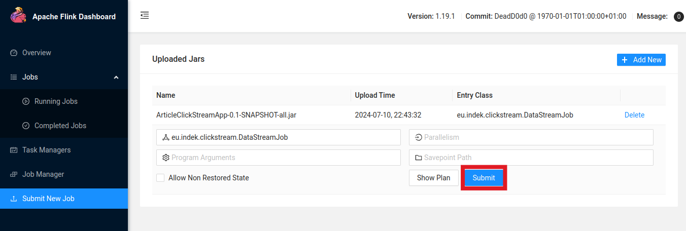
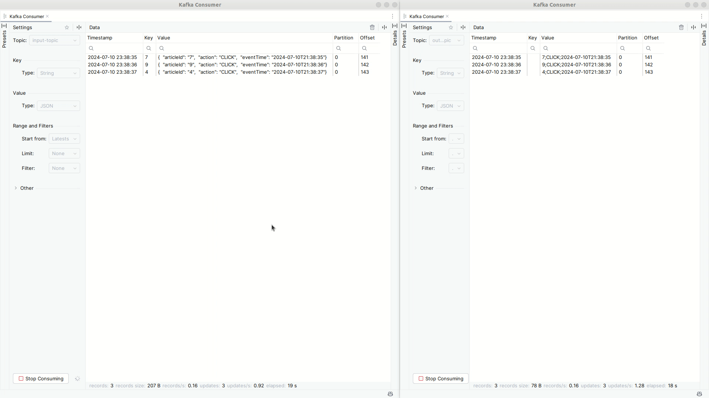

# Apache Flink / Kafka streaming example  

There are three components in this repository:
- Simple Apache Flink application
- CLI app for producing sample messages to the specified Kafka topic
- A `docker-compose.yml` file which specifies the services for Apache Flink and Kafka

There are two options how to test this Apache Flink application:

1. **Running from an IDE:** This will start an embedded Apache Flink instance. The source will be a `DataGeneratorSource` instance generating one message per second, and the sink will be a `PrintSink` that outputs messages to the console.
2. **Running with Docker:** Start the Docker containers specified in the `docker-compose.yml` file, run the sample message producer to push messages to Kafka's `input-topic`, and deploy the Flink application.

## 1. Running the Flink Application from Your IDE

This is the simplest way to test your Flink job. Execute the `main` method of the [DataStreamJob](./src/main/java/eu/indek/clickstream/DataStreamJob.java) class.

You should see output similar to the following in your console:

```
ExecutionGraph - Source: Kafka Source -> Map -> Sink: Writer (1/1) (55f2_0_0) switched from INITIALIZING to RUNNING.
LocalSink> 8;CLICK;2024-07-11T11:38:20Z
LocalSink> 6;CLICK;2024-07-11T11:38:20Z
LocalSink> 10;CLICK;2024-07-11T11:38:20Z
LocalSink> 8;CLICK;2024-07-11T11:38:20Z
LocalSink> 7;CLICK;2024-07-11T11:38:20Z
LocalSink> 2;CLICK;2024-07-11T11:38:20Z
LocalSink> 9;CLICK;2024-07-11T11:38:20Z
LocalSink> 6;CLICK;2024-07-11T11:38:20Z
LocalSink> 10;CLICK;2024-07-11T11:38:20Z
...
```

## 2. Running the Flink Application in Docker

### Prerequisites  
  
You will need:  
- Docker  
- Java 11 (Apache Flink requires Java 8 or 11 for the application JAR files)  
- Gradle  
  
### Starting the Apache Flink and Kafka Services
  
The project contains a [docker-compose.yml](./docker-compose.yml) file specifies these services:  
```  
┌─────────────────────────────────────┐  
│ Apache Kafka                        │  
└─────────────────────────────────────┘  
┌─────────────────────────────────────┐  
│ Apache Flink                        │  
│  ┌────────────┐      ┌───────────┐  │  
│  │ JobManager │      │TaskManager│  │  
│  └────────────┘      └───────────┘  │  
└─────────────────────────────────────┘  
```  
  
Run the following command to start the services:  
```shell  
docker-compose up -d
```  
  
Now you should be able to access the Apache Flink dashboard at http://localhost:8081  
  
### Producing Sample Messages to the Input Topic
  
The `kafka-dummy-producer` is a simple Java application that sends sample messages to the `input-topic` every second.  
See [KafkaDummyProducer](./kafka-dummy-producer/src/main/java/eu/indek/clickstream/KafkaDummyProducer.java).  
  
- Build the producer app:  
  ```  
  ./gradlew --build-file kafka-dummy-producer/build.gradle shadowJar  
  ```

- Run the producer app:
  ```  
  java -jar kafka-dummy-producer/build/libs/kafka-dummy-producer-0.1-SNAPSHOT-all.jar input-topic  
  ```  
Now your `input-topic` is receiving messages in the following format:  
  
```json  
{  
  "articleId": "9",  
  "action": "CLICK",  
  "eventTime": "2024-07-10T20:42:16"
}  
```  
  
### The Apache Flink application  
  
This sample project contains a simple Flink application that:  
- Reads from the `input-topic` containing messages in JSON format  
- Transforms these messages into CSV format  
- Writes the transformed messages to the `output-topic`  
  
See the main application class: [DataStreamJob](./src/main/java/eu/indek/clickstream/DataStreamJob.java)  
  
#### Packaging the Flink Application into a fat JAR  
  
To package your application for submission to Flink, use the following commands.   
Ensure that the `JAVA_HOME` environment variable is set to Java 11, as Apache Flink requires the application JAR files   
to be built using either Java 8 or 11. Adjust the path if necessary.  
  
```bash  
JAVA_HOME=/usr/lib/jvm/jdk-11.0.13  
./gradlew shadowJar
```  
  
The JAR file will be created at: `./build/libs/ArticleClickStreamApp-0.1-SNAPSHOT-all.jar`  
  
#### Submitting the Flink Job  
  
Go to http://localhost:8081/#/submit, and upload that JAR file. After uploading, click on it, and click SUBMIT.  
  
  
  
Now the Flink job should be running. You can see the stream data below (the `input-topic` on the left and the `output-topic` on the right):  
  
