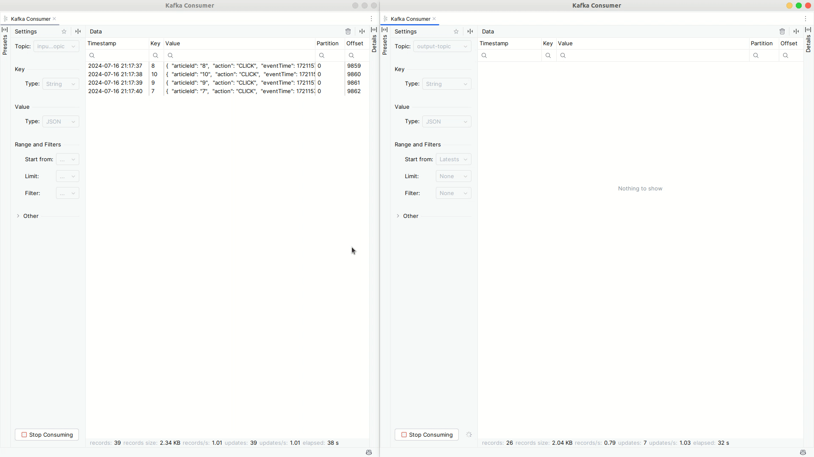

# Apache Flink / Kafka streaming example

## Prerequisites

In order to run this project locally, you will need:
- Docker
- Java 11 (Apache Flink requires Java 8 or 11)
- Gradle

## Running the Apache Flink and Kafka

```shell
docker-compose up -d
```

Now you should be able to access the Apache Flink dashboard at http://localhost:8081

## Starting the producer of dummy messages

The `kafka-dummy-producer` is a simple Java application that sends dummy messages to the `input-topic` every second.
See `./kafka-dummy-producer/src/main/java/eu/indek/clickstream/KafkaDummyProducer.java`

- Build the producer app:
  ```
  ./gradlew --build-file kafka-dummy-producer/build.gradle shadowJar
  ```
- Run the producer app:
  ```
  java -jar kafka-dummy-producer/build/libs/kafka-dummy-producer-0.1-SNAPSHOT-all.jar input-topic
  ```

Now your `input-topic` is receiving messages in the following format:

```json
{
  "articleId": "9",
  "action": "CLICK",
  "eventTime": "2024-07-10T20:42:16"
}
```

## Building the Flink JAR

This sample project contains a simple Flink job that:
- reads from the `input-topic` which contains messages in JSON format 
- transforms the messages to a CSV format
- and writes them to the `output-topic`.

See `./src/main/java/eu/indek/clickstream/DataStreamJob.java`

To package your job for submission to Flink, use the following.
Note that we are setting the `JAVA_HOME` environment variable to ensure that the correct version of Java is used
to build the JAR file (Java 11). Change the path to the correct one if needed.

```bash
JAVA_HOME=/usr/lib/jvm/jdk-11.0.13
./gradlew shadowJar
```

The jar will be created here: `./build/libs/ArticleClickStreamApp-0.1-SNAPSHOT-all.jar`

Go to http://localhost:8081/#/submit, and upload that JAR file. After uploading, click on it, and click SUBMIT.


Now the Flink job should be running. You can see the stream data below (the `input-topic` on the left and the `output-topic` on the right):

